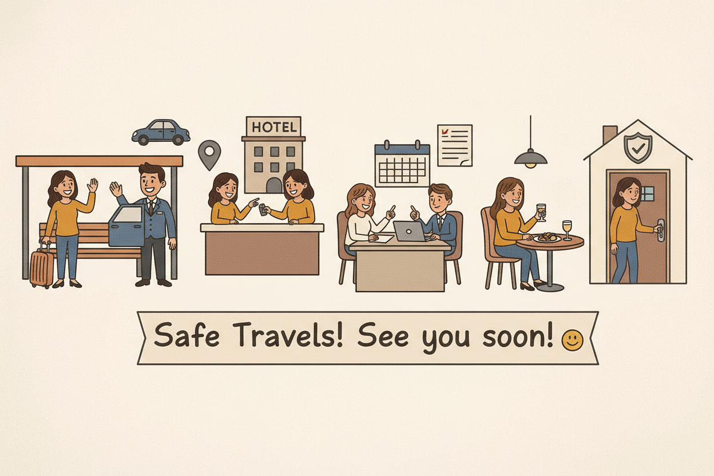

# Case study 
# 🛵🚖 Rapido Care Partner  
## Smart Multi-Stop Ride & Personal Care Partner  

A prototype for full-day itinerary planning and personal driver assignment, designed for new city travelers, corporates, and women-first safety.

---

## 1. Overview  
Rapido Care Partner is a **full-day multi-stop ride and personal care assistant** designed to:  
- Plan your day from **arrival to departure**  
- Suggest **hotels, restaurants, malls, parks, and theaters** during free time  
- Assign a **trusted driver** with vehicle, gender, and language preferences  
- Ensure **safety, comfort, and convenience**, especially for women and first-time city visitors  

---

## ✨ The Story – The Spark  

<table>
<tr>
<td width="50%" align="center" valign="middle">

</td>
<td width="60%" valign="top">

### Picture this:
> One day, a girl received an interview call in a **new city**.  
> Imagine living in **Chennai** but having an interview in **Mumbai** — a city completely unfamiliar.  

She struggled with:  
- Finding a safe and affordable **hotel**  
- Booking a **cab** for pick-up and drop  
- Managing **return travel** back to the bus stand or station  
- Coordinating timings between interview, travel, and waiting periods  

The entire process felt **hectic and stressful**.  
For a **woman in the situation**, the concerns multiply — **safety, trust, and fear of missing the interview or conference**.  

👉 This is where the idea was born.  

</td>
</tr>
</table>

Instead of juggling multiple apps and last-minute stress, **Rapido Care Partner** allows users to **plan the entire day in advance**:  
- Book **hotel, travel, and driver in one go**  
- Get a **trusted driver’s details upfront** (contact, ID, gender, language)  
- Ensure **safety, punctuality, and peace of mind**  

⚡ **Thus, a problem turned into a product:**  
**Rapido Care Partner – One driver, multiple stops, safe and smart travel.**  

---

## 2. Features  

### Full-Day Smart Planner  
- Pick-up from bus stand → hotel → interview/conference → free-time → return  
- Automated travel time estimates based on **distance and traffic**  
- Suggestions for nearby **restaurants, cafes, malls, parks, or theaters**  

### Dynamic Hotel Selection  
- Choose hotel by **star rating and reviews**  
- Flexible, user-driven selection  

### Personal Driver Assignment  
- Single driver for the day  
- Vehicle: Bike, Auto, Cab  
- Driver gender: Male, Female  
- Language preference: English, Tamil, Any  
- Driver details visible upfront: photo, license, ID proof, contact  

### Safety & Security  
- Prioritizes **women-first safety**  
- Transparent driver info ensures trust and confidence  

### Emotional connect 
  > 🎉 *Happy journey! All the best. Wishing you success!* 🎉  
  - Personalized caring and farewell message

---

<table>
<tr>
<td width="60%" align="center" valign="middle">

</td>
<td width="60%" valign="top">

## 3. Prototype Flow  
1. **Plan My Day** → Enter arrival, event, and return times  
2. **Select Company/Conference Location**  
3. **Choose Hotel** → Star rating & review displayed  
4. **Assign Driver (Optional)** → Vehicle, gender, language selection  
5. **View Day Plan & Driver Info** → Full itinerary and trusted driver details  
6. **Warm Farewell Message**  

</td>
</tr>
</table>

- **Prototype flow Demo:** [Rapido - Care Partner](https://raguram-n.github.io/Smart-Multi-Stop-Ride---case-study/)  
- **Demo Video:** [Watch Here](https://github.com/Raguram-N/Smart-Multi-Stop-Ride---case-study/blob/main/Demo%20Video.mp4) - (Click "view raw" to download the video)
- **web design (figma):** [Link](https://www.figma.com/make/bk7MVBe9APeP3b2LnGTJmN/Rapido-Care-Partner-Prototype?node-id=0-1&p=f&t=d6iisE3uteGKQmse-0&fullscreen=1)

---

## 4. Benefits  

### For Users  
- Saves **planning time** and reduces travel stress  
- Ensures **continuity and safety** with a trusted single driver  
- Makes waiting periods **productive/enjoyable** via nearby suggestions  
- Ideal for **corporate meetings, interviews, conferences, and sightseeing**  
- **Woman-first design** ensures safety and peace of mind  

### For Corporates  
- Seamless employee travel → punctuality & productivity  
- Corporate billing → simplified expense management  
- Scalable for multiple employees  

### For Rapido  
- Higher ride utilization → one driver completes multiple stops efficiently  
- Differentiates Rapido with **full-day multi-stop scheduling and engagement features**  
- Increases customer loyalty via **personalized value-added suggestions**  

---

## 5. Target Audience  
- Corporate Professionals: Conferences, client meetings, interviews  
- New-to-City Travelers: Students, consultants, relocating employees  
- Women Travelers: Safety and reliable scheduling  
- Tourists: Multi-stop sightseeing or errands in one ride  

---

## 6. Market Opportunity  
- **Metro Cities:** Chennai, Bangalore, Hyderabad, Pune, Delhi-NCR (~50M daily commuters)  
- **Corporate Travel Segment:** 2–5M professionals/year attending interviews, meetings, or conferences  
- **New-to-City / Student Segment:** 1–2M students & young professionals relocating yearly  

**Conservative estimate:** 5–10M potential multi-stop ride users in India initially  

---

## 7. 💰 Revenue Opportunity  

| User Segment            | Users      | Monthly Revenue (₹) | Annual Revenue (₹ Cr) |
|--------------------------|-----------|---------------------|-----------------------|
| Corporate Professionals | 1,00,000  | 2.4–4 Cr            | 28.8–48               |
| Students/New Entrants   | 5,00,000  | 12–20 Cr            | 144–240               |
| **Total**               | 6,00,000  | 14.4–24 Cr          | 172.8–288             |

Additional revenue from **premium scheduling, multi-stop dynamic pricing, corporate plans, and in-app promotions for nearby venues**.  

---

## 8. Competitive Advantage  
- Continuous multi-stop scheduling with a **single trusted driver**  
- **Dynamic hotel selection** and free-time activity suggestions  
- **Woman-first safety** and transparency with full driver details  
- Corporate-friendly and scalable  
- Enhances app stickiness via **personalized suggestions and engagement**  

---

## 9. Prototype Tech  
- **Stack:** HTML, CSS, JavaScript  
- **Type:** Interactive front-end prototype  
- **Usage:**  
  1. Click **Plan My Day**  
  2. Enter arrival, event, return time, and company location  
  3. Select hotel  
  4. Optionally assign driver with preferences  
  5. View day plan and driver info  

---

## 10. Conclusion  
**Rapido Care Partner** is a **smart, user-centric solution**:  
- One driver, multiple stops, automated planning  
- Personalized recommendations for free time  
- Safe, secure, and convenient — perfect for **women, corporates, and first-time city visitors**  

**Tagline:**  
**“One driver, multiple stops, smart suggestions — seamless and safe city travel.”**  

---

## 🔑 Takeaway  

**Care the Customer → Build the Market**  

---

## ✍️ Author  
**RAGURAM NARAYANASWAMY**  

## 📂 Repo Purpose  
**Product Case Study & Growth Proposal for Rapido**  
